# boothcsv

> Amazonのアソシエイトとして、8796.jpは適格販売により収入を得ています。

BOOTHの「未発送注文のCSV」を使って帳票と発送通知用CSVを作るやつ

> 💡 **初めて使う方へ**: このページでは詳しい使い方を説明しています。すぐに使い始めたい方は[基本的な使い方](#どうやって使うの)からご覧ください。

## おしらせ

* これは便利だーって思っていただいたおやさしい方はデバッグに協力すると思って[NyanticLabs.](https://nyantic.booth.pm/)からなんか買ってください。これを使って帳票印刷して送ります。

## 想定する使用対象者は誰？

[BOOTH](https://booth.pm/)で自家通販をしている人で主に「[あんしんBOOTHパック](https://booth.pm/anshin_booth_pack_guides)」の利用者

## おまえはだれだ？

JavaScriptとかなるべく使いたくないBOOTHで自家通販しているあんしんBOOTHパック利用者の猫グッズ屋のおじさん。  
端的に言えば自分で使う用。

## なんで作ったの？

猫グッズを売るときに手数料も安いし手軽に出品できるし匿名配送も使えるのでpixivさんのやってるBOOTHって便利なんですよ。  
そのBOOTHで自家通販をすると、当然ですが売れたら誰かに何かを送ります。  
発送処理をしていて箱に入れる商品どれ？いくつ？みたいなことがよくあったので誤発送を防止するために作りました。

あんしんBOOTHパックで送るときに誰に送るかが分からないため、外箱に注文番号とか印刷したシールがあると便利だよね？それにネコピットで読み込むQRコードがあればもっと便利だよね？ってことでそれもできるようにしました。  
仕組みで防げる誤発送は無くそう！

## なにができるの？

出荷準備のときにあると便利な帳票と「あんしんBOOTHパック」で出荷のときに便利なQRコードをラベルシールに印刷できます。  
あと、注文明細に画像を追加して印刷することもできるようになりました。全注文共通の画像と注文ごとの個別画像が設定でき、表示のON/OFF切り替えも可能です。  
さらに、カスタムラベル機能により任意の文字列を複数面印刷することも可能です。

発送後は、選択した注文だけをまとめた発送通知用CSVを作成し、BOOTHで発送完了を通知できます。

### 📝 最新の改善点

* **CSVでまとめて発送通知**: 選択した注文の行だけを抽出し、保存済みコメントを反映したCSVを作成できます。BOOTHで通知完了を確認した後、対象注文だけに発送日時を記録します
* **リアルタイム処理**: CSVファイルを選択すると自動的に処理が実行されるようになりました
* **ワークフロー最適化**: CSVダウンロード → ファイル選択 → 印刷の流れが分かりやすいレイアウトに変更
* **直感的な操作**: 手動実行ボタンを廃止し、シンプルで分かりやすいUIに改善
* **処理済み注文一覧の拡張**: 保存済み注文を一覧表示し、注文番号リンク・QR/画像アイコン・未印刷/未発送フィルタ・ページ移動・列ソートに対応しました
* **選択注文の再プレビュー改善**: 注文一覧から複数選択して印刷プレビューできるようになり、設定変更時も選択中の注文プレビューを再生成しやすくしました
* **印刷と編集の安定化**: 印刷完了後のスキップ面数がCSV再読み込み後も正しく反映されるよう修正し、カスタムラベルの右クリックメニュー位置ずれも改善しました
* **サイドバー導入**: 設定（ラベル印刷・画像・カスタムラベル・保存データ操作）をサイドバーに統合。左上のハンバーガーで開閉、ピン留めで固定表示（初期は固定）
* **ヘルプの一元化**: 使い方ガイドは設定サイドバー右上のボタンからいつでも開けます
* **バックアップ/リストア**: ブラウザに保存されたデータ（フォント/設定/注文/カスタムラベル/画像）をJSONで一括バックアップ/リストアできるようにしました
* **カスタムラベルの安定化**: 複数のラベルを続けて追加したときも、正しく保存されるようにしました
* **QR画像の再読み込み安定化**: ページを再読み込みした後も、保存したQR画像を表示できるようにしました

## 動作環境は？

Windows版のChrome 146で動作確認をしています。  
最近のChromeなら動くと思いますが仕様が変わると動かない機能もあるかもしれません。  
スマートフォンのChromeだとラベルシール印刷がズレると思うのでたぶん駄目です。  
JavaScriptでどうにかしているので、**基本的な用途では別途サーバーなどは必要ありませんし、外部に情報を送ることもありません。**

## 📋 目次

* [プリンター持ってない方向け](#プリンター持ってない方向け)
* [基本的な使い方](#どうやって使うの)
* [ラベルシール印刷](#ラベルシールも印刷したい)
* [画像機能について](#画像機能について)
* [カスタムラベル機能について](#カスタムラベル機能について)
* [CSV処理結果について](#csv処理結果について)
* [CSVでまとめて発送通知](#csvでまとめて発送通知)
* [データのバックアップとリストア](#データのバックアップとリストア)

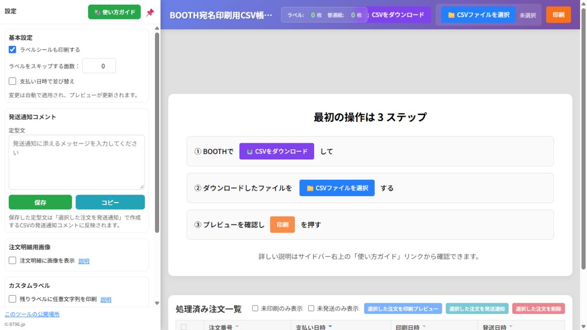

## どうやって使うの？

* [ここ](https://github.com/8796n/boothcsv/archive/master.zip)からzipファイルをダウンロードして展開します。
* boothcsv.html を Chrome から開きます。
* 左上のハンバーガー（≡）で設定サイドバーを開きます（初期は固定表示）。
* 注文明細の余白に画像を印刷したい場合は、サイドバーの「注文明細用画像」内で「注文明細に画像を表示」にチェックを入れます。
* 全ての注文に同じ画像を表示したい場合は、サイドバー内のグローバル画像ドロップゾーンに画像をドラッグ&ドロップするかクリックしてファイル選択します。商品IDごとに画像を設定できますが、CSVの読み込み後に設定できるようになります。
* カスタムラベルを印刷したい場合は、サイドバーの「残りラベルに任意文字列を印刷」をオンにして、印刷したい文字列と面数を設定します。複数のカスタムラベルを設定したい場合は「ラベル追加」ボタンで項目を追加できます。
* **📥 CSVをダウンロード**ボタンを押してBOOTHの「未発送注文のCSV」をダウンロードします。
* **📁 CSVファイルを選択**ボタンでダウンロードしたファイルを読み込みます。
* ファイルを選択すると**自動的に処理が実行**され、印刷に必要な枚数が表示されます。
* 支払い日時で並び替えたい場合はチェックボックスにチェックを入れます。BOOTHからダウンロードしたCSVは新しい注文が上に来るので、支払いの古い順に並べ替えたい場合に便利です。
* 特定の注文だけ別の画像を表示したい場合は、その注文明細の「この注文専用の画像（グローバル画像より優先されます）」のところに画像をドロップします。個別画像はグローバル画像より優先されるので、設定すればその注文だけ別の画像が表示されます。
* 「注文明細に画像を表示」のチェックを外すと、設定した画像は保持されたまま表示だけを切り替えできます。リアルタイムで反映されるので印刷時の調整に便利です。
* ラベルシールも印刷するときの説明はまたあとで。
* プリンターに用紙をセットして印刷します。
* おしまい。

## ラベルシールも印刷したい

これね、ヤマトの営業所持ち込みであんしんBOOTHパック使うときにはすげえ便利なんですよ。[PUDOステーション](https://booth.pixiv.help/hc/ja/articles/360013148033)に放り込むときにもめっちゃ便利です。慣れると1出荷15秒ぐらいでできます。

  補足: ラベルに表示される各注文番号は BOOTH の注文詳細ページ（例: `https://manage.booth.pm/orders/<注文番号>`）へのリンクになっています。リンク先であんしんBOOTHパック用のQRコードを生成・コピーできるため、該当注文のラベルから直接 QR 発行フローへ移動できます。

* A4 44面 四辺余白付のラベルシールを用意します。例えば[これ](https://amzn.to/2KkRXhE)とか[これ](https://amzn.to/2KpdW7k)
* サイドバーの「ラベルシールも印刷する」にチェックを入れます。
* 途中まで使ったラベルシールを再使用する場合にはサイドバー内の「スキップ面数」を入力します。あまり再使用しすぎるとプリンターの中で剥がれたりするかもしれないのでほどほどに。
* **📥 CSVをダウンロード**ボタンでBOOTHにアクセスしてCSVをダウンロードし、**📁 CSVファイルを選択**ボタンでファイルを選択すると、ラベル用紙の枚数も自動的に表示されます。

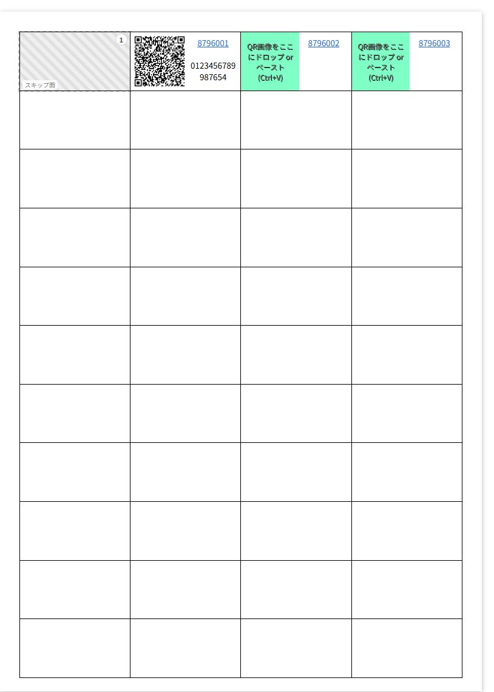

* BOOTHの注文詳細で[あんしんBOOTHパックのQRコードを作成](https://booth.pm/anshin_booth_pack_guides/usage)して、表示されたQRコードの画像を右クリックでコピーしてから該当の注文番号のラベルの「QR画像をここにドロップ or ペースト（Ctrl+V）」に貼り付けるとQRコードが表示されて自動的に匿名配送の受付番号とパスワードが表示されます。自動です。オートマチック！！
* なお間違えて貼り付けたときは**QRコードをクリック**すると再度貼り付けできるようになります。
* 印刷したラベルシールを出荷する箱に貼り付けておけば出荷時にネコピットを箱に貼ったQRコードにかざす→その箱に貼る送り状が印刷されるという流れになるので送り間違いは発生しません。万が一QRコードの読み込みが上手く行かなかった場合でもラベルシールに印刷されている受付番号とパスワードを入力すれば送り状が出力できるので安心です。

## 画像機能について

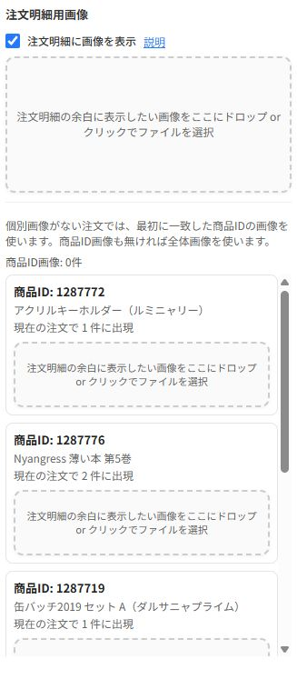

注文明細に画像を追加できる機能があります（サイドバーの「注文明細用画像」で有効化）。

### 画像のアップロード状態

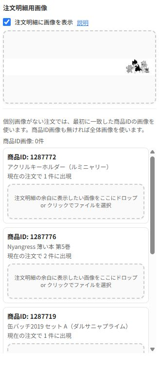

### 基本的な使い方

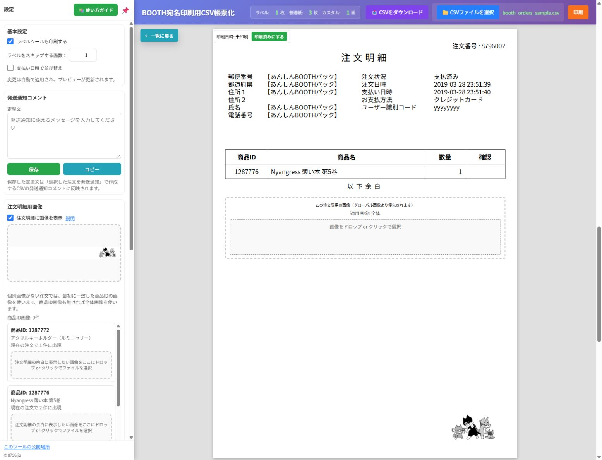

1. **画像表示の有効化**: まず「注文明細に画像を表示」にチェックを入れてください。
2. **画像設定**: 以下の3つの方法で画像を設定できます：
   * **グローバル画像**: 全ての注文明細に同じ画像を表示したい場合。「注文明細の余白に表示したい画像をここにドロップ or クリックでファイルを選択」の部分に画像をドロップするか選択します。
   * **商品ID画像**: 商品IDごとに表示させる画像を切り替えたい場合に使用します。商品によって注意書きを変更したい場合などに使用できますが、複数商品を注文された場合は最初の商品IDの画像が表示されます。
   * **個別画像**: 特定の注文だけ別の画像を表示したい場合。実行後に表示される各注文明細の「この注文専用の画像」部分に画像をドロップします。
3. **表示切り替え**: 「注文明細に画像を表示」のチェックを外すと、設定した画像は保持されたまま表示だけをリアルタイムで切り替えできます。印刷時の調整に便利です。

**対応画像形式**: JPEG、PNG、SVG（.jpg、.jpeg、.png、.svg）

個別画像は最優先、次に商品ID画像で、どちらも設定されていない場合にはグローバル画像が使用されます。つまり個別画像を設定した注文はその画像が、設定しなかった注文は商品ID画像かグローバル画像が表示されます。

画像とQRコード情報はブラウザ内に保存されるので、ページを再読み込みしても残ります。不要になったらクリアボタンで削除できます：

* **全ての注文データをクリア**: 注文情報・QR・個別画像をまとめて削除（グローバル画像/商品ID画像/フォント/設定は残る）

画像をクリックすると削除されるので、間違えて設定した場合も簡単にリセットできます。印刷時は画像ドロップゾーンは表示されないので邪魔になりません。

## カスタムラベル機能について

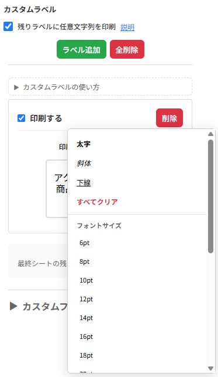

余った44面シールに商品名や管理用文字列を印刷できる機能です。商品管理や在庫整理の際に便利です。

### カスタムラベルのシート表示

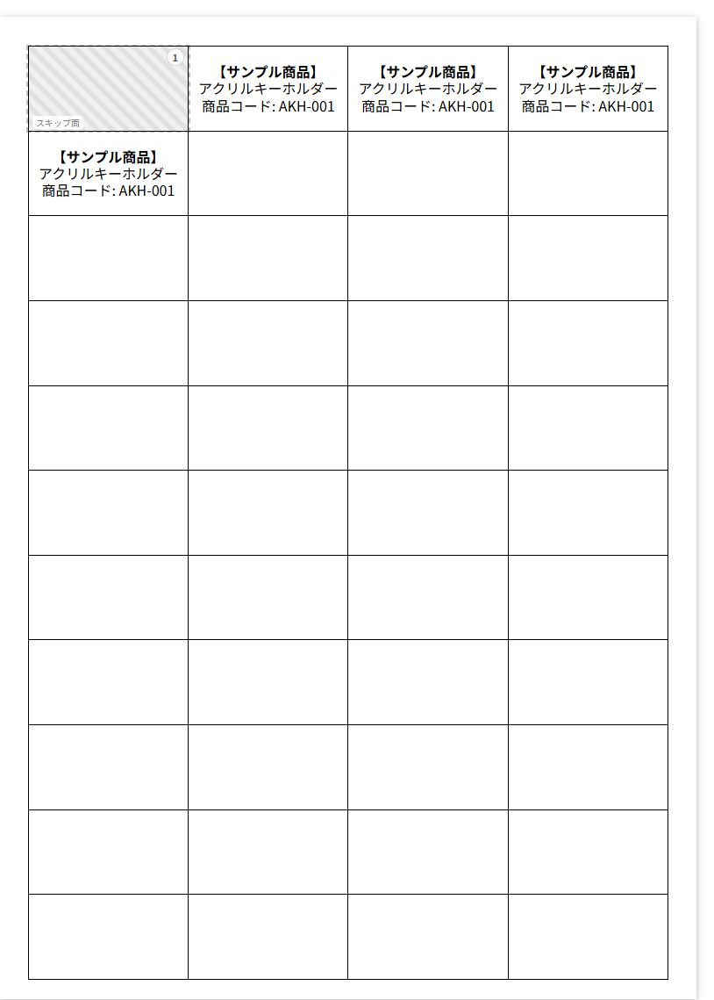

### 設定方法

* **有効化**: サイドバーの「残りラベルに任意文字列を印刷」をオンにします。
* **文字列入力**: ラベルに印刷したい文字列を入力します。商品名、品番、管理コードなど任意のテキストが可能です。文字列を選択して右クリックメニューから太字や斜体、フォントサイズの変更もできます。
* **面数設定**: 印刷したい面数を指定します。
* **複数ラベル**: 「ラベル追加」ボタンで複数のカスタムラベルを設定できます。
* **削除**: 不要なラベルは「削除」ボタンで削除できます（最低1つは必要）。

**文字列の編集方法**：


* テキストエリア内で普通に文字を入力
* 改行: Enterキー
* 書式設定: 右クリックでコンテキストメニューを表示
  * 太字、斜体、下線の切り替え
  * フォントサイズの変更（6pt〜28pt）
  * フォント変更（システムフォント＋カスタムフォント）
* キーボードショートカット:
  * Ctrl+B: 太字の切り替え
  * Ctrl+I: 斜体の切り替え
  * Ctrl+U: 下線の切り替え

### 🎨 カスタムフォント機能

カスタムラベルでは独自のフォントファイルをアップロードして使用できます。

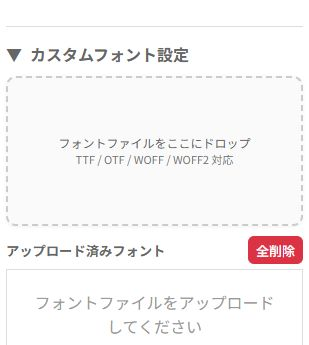

**フォントファイルのアップロード**：

* 「カスタムフォント設定」セクション（デフォルトで折りたたまれています）を展開
* フォントドロップゾーンにTTF、OTF、WOFF、WOFF2形式のフォントファイルをドラッグ&ドロップ
* アップロードしたフォントは自動的にブラウザに登録され、すぐに使用可能になります
* 対応フォーマット: TTF、OTF、WOFF、WOFF2

**フォントの適用方法**：

* カスタムラベルのテキスト入力欄で文字を選択
* 右クリックでコンテキストメニューを表示
* 「フォント変更」→「カスタムフォント」から使用したいフォントを選択
* 選択した文字のフォントが変更されます

**フォント管理**：

* アップロード済みフォント一覧でフォントの確認・削除が可能
* カスタムフォント設定の「全削除」ボタンで一括削除
* フォントデータはブラウザ内に保存されます

> **注意事項**: フォントファイルは著作権に注意して使用してください。大きなフォントファイルは読み込みに時間がかかる場合があります。ブラウザのデータクリア時にフォントデータも削除される可能性があります。

設定した内容はブラウザ内に保存されるので、ページを再読み込みしても残ります。

## CSV処理結果について

CSVファイルを読み込むと、自動的に以下の印刷用データが生成されます：

### 処理済み注文一覧

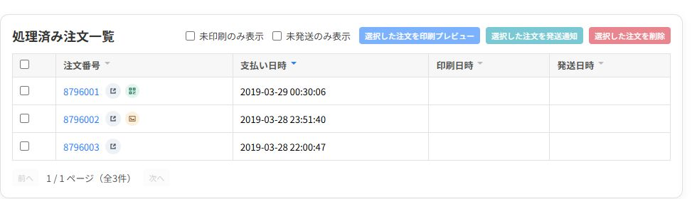

CSVを読み込んで保存済み注文ができると、初期ガイドの下に処理済み注文一覧が表示されます。

* 注文番号を押すと、その注文だけの印刷プレビューを開けます
* 注文番号の右側には BOOTH 注文詳細へのリンクが付きます
* QRコードを保存済みの注文には QR アイコン、個別画像を保存済みの注文には画像アイコンが付きます
* 「未印刷のみ表示」「未発送のみ表示」で絞り込みできます
* 複数選択して印刷プレビュー、発送通知、削除ができます

### 注文明細印刷プレビュー

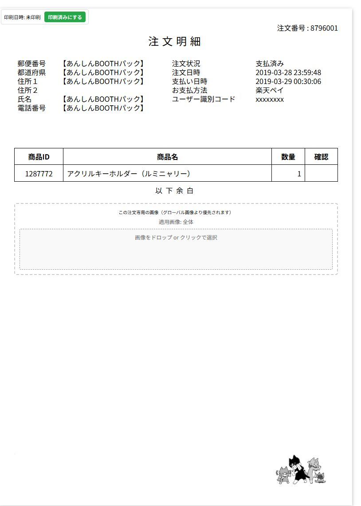

各注文の詳細情報が印刷に適したフォーマットで表示されます。画像機能を有効にしている場合は、設定した画像も表示されます。

支払方法は独立した行に表示し、長い支払方法も読みやすく印刷できます。匿名配送と判別できる注文では、空欄の宛先項目に配送サービス名を表示します。住所や氏名がある場合はそのまま印字します。注文状況と発送サイズは印字しません。

CSVを読み直しても、保存済みの印刷日時・発送日時・発送通知コメント・QRコード・個別画像は保持されます。

## CSVでまとめて発送通知

発送した注文を選び、保存済みの発送通知コメントを入れた発送通知用CSVを作成できます。帳票作成時に「未発送注文のCSV」を読み込み済みの注文は、再ダウンロード・再選択が不要です。

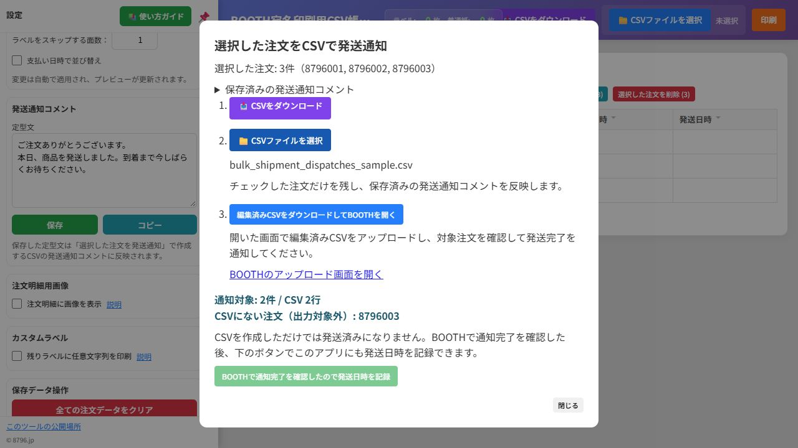

1. 設定サイドバーの「発送通知コメント」に定型文を入力し、「保存」を押します。保存したコメントが対象行の「発送通知コメント」列に入ります。
2. 処理済み注文一覧で発送した注文にチェックを入れ、「選択した注文を発送通知」を押します。
3. 通知対象件数と出力対象外の注文を確認します。**「未発送注文のCSV」をまだ読み込んでいない注文と、発送日時を記録済みの注文は出力しません。** 取り込み済みの注文だけで続行できます。
4. 未取り込みの注文も対象に加える場合だけ、表示された「📥 CSVをダウンロード」と「📁 CSVファイルを選択」で「未発送注文のCSV」を読み込みます。
5. 「編集済みCSVをダウンロードしてBOOTHを開く」を押します。
6. 開いた[BOOTHの一括発送通知画面](https://manage.booth.pm/bulk_shipment_dispatches/current)に**編集済みCSV**をアップロードし、対象注文を確認して発送完了を通知します。
7. BOOTHで通知完了を確認したらこのアプリに戻り、「BOOTHで通知完了を確認したので発送日時を記録」を押します。

CSVを作成・ダウンロードしただけでは、発送完了通知は送信されません。BOOTHで通知完了を確認してから最後のボタンを押すと、出力した注文に、そのボタンを押した時刻と出力に使ったコメントを記録します。CSVを読み直しても、この記録は保持されます。

発送通知に使う注文情報とコメントも、バックアップ・リストアの対象です。

### CSVを読み込めない・対象注文がないとき

* 「📥 CSVをダウンロード」から取得した「未発送注文のCSV」を選んでください。
* CSVの形式に関するエラーが出る場合は、ダウンロードしたファイルを編集せずに選び直してください。同じエラーが続く場合は、ツールが最新版か確認してください。
* 通知対象から外れた注文は、画面に注文番号が表示されます。必要に応じて最新のCSVを読み込んでください。出力できる注文が1件もない場合は、発送通知用CSVを作成できません。

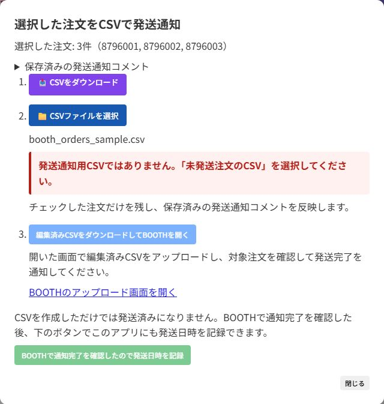

### BOOTHで「送り状が未発行など」と表示されるとき

あんしんBOOTHパックでは、QRコード（発送コード）が未発行の注文を含めると、BOOTHで「発送できません（送り状が未発行など）」と表示されることがあります。注文詳細で発送コードを発行し、発送を済ませてから発送通知用CSVを再アップロードしてください。発送コードの発行だけなら、取り込み済みのCSVを取得し直す必要はありません。

BOOTHで通知が完了するまでは、本アプリの「BOOTHで通知完了を確認したので発送日時を記録」を押さないでください。

### BOOTHで確定待ちの間に注文を追加で取り込みたいとき

BOOTHで発送完了通知の確定待ちになっていても、本アプリの「📥 CSVをダウンロード」から最新の「未発送注文のCSV」を取得できます。アップロードを取り消す必要はありません。新しい注文が入った場合も、このボタンから取得して読み込んでください。

## データのバックアップとリストア

ツール内の「保存データ操作」から、保存データを安全にバックアップ/リストアできます。

### バックアップ手順（JSON出力）

* 「📥 データバックアップ」ボタンを押す
* ダウンロードされた `boothcsv-backup-YYYYMMDD-HHMMSS.json` を安全な場所に保存

### リストア手順（上書き）

* 「📤 データリストア」ボタンを押してバックアップJSONを選択
* 確認ダイアログで承認すると、保存済みデータはバックアップの内容で上書きされ、ページを再読み込みします

### バックアップ対象に含まれるもの

* フォント（アップロードしたカスタムフォント）
* 設定（チェックボックスや各種設定値、グローバル画像など）
* 商品ID画像 (商品IDごとに設定した画像)
* 注文データ（QR・注文明細の個別画像を含む）
* カスタムラベル（作成順も復元）

### 注意事項

* リストアは上書きです。現在の全データが置き換わります
* 同じブラウザ/PC間での利用を推奨します（別環境でも動作はしますが、フォント適用などに環境差が出る可能性があります）
* バックアップデータが不正な場合はエラーになります（破損や改変に注意）
* 別PCへ引き継ぐ場合は、バックアップJSONをエクスポートして移行先でリストアしてください
* データはブラウザ内に保存されます。別のブラウザやPCへの自動同期には対応していません

## BOOTHで売れてないけど試したい

* sampleにcsvファイルとQRコードのpngファイルがあるので試せます。
* 参考までに手元にあるpngファイルは直接該当箇所にドラッグアンドドロップすれば貼り付けられます。画像機能も同じようにドラッグ&ドロップで試せます。
* 当然ですが、サンプルのデータはダミーの数字が入っているので出荷では使えません。

## 使ってる仕組み

* 印刷に便利なCSS [Paper CSS](https://github.com/cognitom/paper-css)
* QRコード読んでくれるJavaScript [jsQR](https://github.com/cozmo/jsQR)
* CSVをいい感じに読んでくれるJavaScript [PapaParse](https://github.com/mholt/PapaParse)

## 動けばOK主義者

* なんで動いてるかよくわからないところはだいたい潰して理解したつもりです。
* 印刷物に関係ないフォームの部分などは動けばOK主義者なので必要最小限です。見た目にこだわる方はプルリクエスト？とかいうやつをしていただけるといいと思います。

## プリンター持ってない方向け

うちで使っているのは[これ](https://amzn.to/470tC9N)の古いヤツです。手差しトレイにラベルシールを必要枚数セットして、売上明細の印刷は普通紙を下のトレイに入れとくと便利です。
在庫の配置と梱包材の準備をしておけば慣れると1日100個ぐらいの出荷は余裕で捌けると思います。
さらに後述するカスタムラベルの印刷を利用することで在庫管理用のラベルシール印刷にも活用できます。

## ローカルでの簡易サーバーの使い方

このリポジトリには、ローカルで簡単にファイルを配信するためのスクリプトが含まれています。Chrome から `boothcsv.html` を開くときに便利なもので、同じフォルダ内のファイルをホストします。

### 🪟 Windows の場合 (`boothcsv.ps1`)

#### 実行手順（Windows の PowerShell / pwsh）

1. リポジトリのルート（`boothcsv.ps1` があるフォルダ）に移動します。
2. 必要に応じて実行ポリシーを設定します（下記参照）。
3. スクリプトを実行します:

```powershell
# 標準的な実行
.\boothcsv.ps1

# ポートを指定する例（既定は 8796）
.\boothcsv.ps1 -Port 8080
```

起動すると既定のブラウザで `http://localhost:<ポート>/` を開きます（`-OpenBrowser $false` で自動起動を抑制できます）。

#### 実行ポリシーの設定

スクリプトをローカルで実行するために、ユーザーの実行ポリシーを一時的に緩和する必要がある場合があります。安全な最低限の設定例（カレントユーザーのみ）:

```powershell
Set-ExecutionPolicy RemoteSigned -Scope CurrentUser
```

`RemoteSigned` は「ローカルで作成したスクリプトは実行できるが、インターネットから取得した署名のないスクリプトはブロックする」ポリシーです。システム全体に影響を与えない `-Scope CurrentUser` を指定することでユーザーアカウント単位でのみ設定します。

#### リスクと注意事項

* `Set-ExecutionPolicy` はセキュリティ設定に影響します。信頼できないスクリプトや配布元不明のファイルを実行しないでください。
* `RemoteSigned` は比較的安全な選択ですが、ローカルで作成した悪意のあるスクリプトは実行される可能性があります。スクリプトの内容を必ず確認してください。
* 設定を戻す場合は以下を実行します（必要に応じて）:

```powershell
Set-ExecutionPolicy Restricted -Scope CurrentUser
```

もし組織のポリシーや管理者権限で制限されている環境では、IT 管理者に相談してください。

### 🍎 macOS / 🐧 Linux の場合

#### 方法1: シェルスクリプト使用 (`boothcsv.sh`)

1. リポジトリのルート（`boothcsv.sh` があるフォルダ）に移動します。
2. 初回のみ実行権限を付与します:

```bash
chmod +x boothcsv.sh
```

1. スクリプトを実行します:

```bash
# 標準的な実行
./boothcsv.sh

# ポートを指定する例
./boothcsv.sh -p 8080

# ブラウザを自動起動しない場合
./boothcsv.sh --no-browser
```

#### 方法2: Pythonのhttp.server使用（推奨）

Python 3がインストールされている場合は、次の方法でも起動できます:

```bash
# ファイルがあるフォルダで実行
python3 -m http.server 8796

# ブラウザで http://localhost:8796 を開く
# 停止するには Ctrl+C
```

#### その他の方法

**Node.js利用可能な場合:**

```bash
npx http-server -p 8796 -o
```

**PHP利用可能な場合:**

```bash
php -S localhost:8796
```

---
（補足）これらのスクリプトは簡易的な開発用ツールです。本番環境に公開する用途や外部からのアクセスを常時受ける用途には設計されていません。
