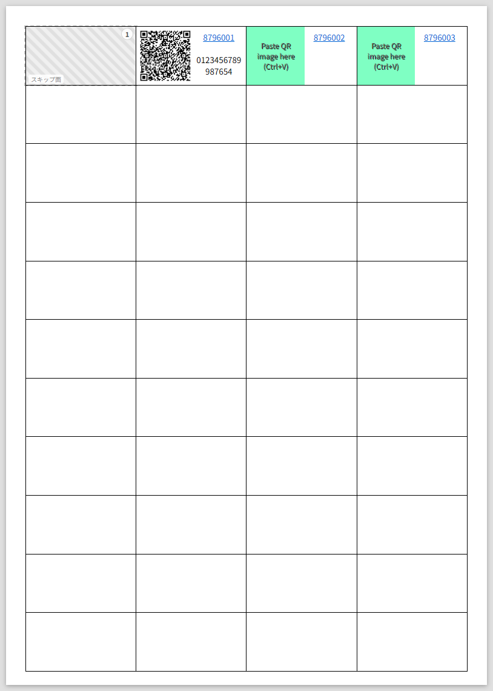
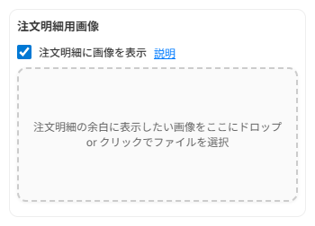
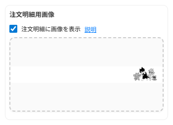
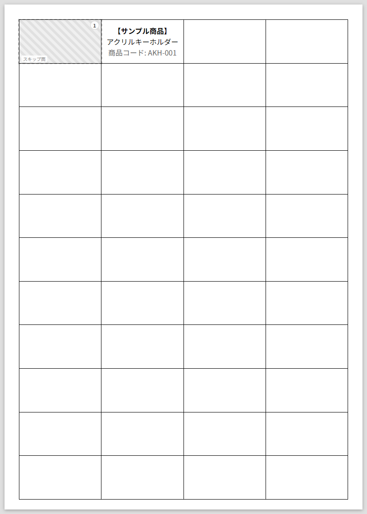
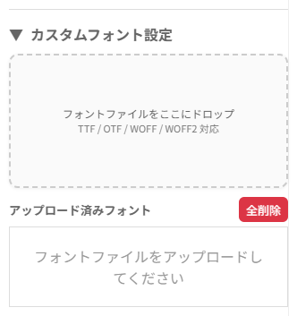
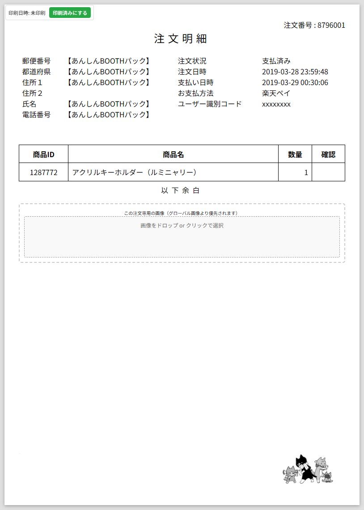

# boothcsv

> Amazonのアソシエイトとして、8796.jpは適格販売により収入を得ています。

BOOTHの宛名印刷用CSVを使って帳票を作るやつ

> 💡 **初めて使う方へ**: このページでは詳しい使い方を説明しています。すぐに使い始めたい方は[基本的な使い方](#どうやって使うの)からご覧ください。

## おしらせ

* これは便利だーって思っていただいたおやさしい方はデバッグに協力すると思って[NyanticLabs.](https://nyantic.booth.pm/)からなんか買ってください。これを使って帳票印刷して送ります。

## 想定する使用対象者は誰？

[BOOTH](https://booth.pm/)で自家通販をしている人で主に「[あんしんBOOTHパック](https://booth.pm/anshin_booth_pack_guides)」の利用者

## おまえはだれだ？

JavaScriptとかなるべく使いたくないBOOTHで自家通販しているあんしんBOOTHパック利用者の猫グッズ屋のおじさん。  
端的に言えば自分で使う用。

## なんで作ったの？

猫グッズを売るときに手数料も安いし手軽に出品できるし匿名配送も使えるのでpixivさんのやってるBOOTHって便利なんですよ。  
そのBOOTHで自家通販をすると、当然ですが売れたら誰かに何かを送ります。  
発送処理をしていて箱に入れる商品どれ？いくつ？みたいなことがよくあったので誤発送を防止するために作りました。

あんしんBOOTHパックで送るときに誰に送るかが分からないため、外箱に注文番号とか印刷したシールがあると便利だよね？それにネコピットで読み込むQRコードがあればもっと便利だよね？ってことでそれもできるようにしました。  
仕組みで防げる誤発送は無くそう！

## なにができるの？

出荷準備のときにあると便利な帳票と「あんしんBOOTHパック」で出荷のときに便利なQRコードをラベルシールに印刷できます。  
あと、注文明細に画像を追加して印刷することもできるようになりました。全注文共通の画像と注文ごとの個別画像が設定でき、表示のON/OFF切り替えも可能です。  
さらに、カスタムラベル機能により任意の文字列を複数面印刷することも可能です。

### 📝 最新の改善点

* **リアルタイム処理**: CSVファイルを選択すると自動的に処理が実行されるようになりました
* **ワークフロー最適化**: CSVダウンロード → ファイル選択 → 印刷の流れが分かりやすいレイアウトに変更
* **直感的な操作**: 手動実行ボタンを廃止し、シンプルで分かりやすいUIに改善
* **サイドバー導入**: 設定（ラベル印刷・画像・カスタムラベル・保存データ操作）をサイドバーに統合。左上のハンバーガーで開閉、ピン留めで固定表示（初期は固定）
* **ヘルプの一元化**: 使い方ガイドはヘッダー右側のボタンからいつでも開けます
* **バックアップ/リストア**: ブラウザのIndexedDBに保存されたデータ（フォント/設定/注文/カスタムラベル/画像）をJSONで一括バックアップ/リストアできるようにしました
* **カスタムラベルの安定化**: カスタムラベルを独立ストア化（DB v8）。UNIXミリ秒のタイムスタンプをキーにし、同一ミリ秒衝突時は自動で単調増加させて衝突回避します
* **QR画像の再読み込み安定化**: ArrayBufferの画像をBlob URL化して表示するようにし、再読み込み後も404にならないよう改善しました

## 動作環境は？

Windows版のChrome 138で動作確認をしています。  
最近のChromeなら動くと思いますが仕様が変わると動かない機能もあるかもしれません。  
スマートフォンのChromeだとラベルシール印刷がズレると思うのでたぶん駄目です。  
JavaScriptでどうにかしてるので**別途サーバーなどは必要ありませんし外部に情報を送ることもありません。**

## 📋 目次

* [プリンター持ってない方向け](#プリンター持ってない方向け)
* [基本的な使い方](#どうやって使うの)
* [ラベルシール印刷](#ラベルシールも印刷したい)
* [画像機能について](#画像機能について)
* [カスタムラベル機能について](#カスタムラベル機能について)
* [CSV処理結果について](#csv処理結果について)
* [データのバックアップとリストア](#データのバックアップとリストア)


## どうやって使うの？

* [ここ](https://github.com/8796n/boothcsv/archive/master.zip)からzipファイルをダウンロードして展開します。
* boothcsv.html を Chrome から開きます。
* 左上のハンバーガー（≡）で設定サイドバーを開きます（初期は固定表示）。
* 注文明細に画像を印刷したい場合は、サイドバーの「画像とカスタムラベル」内で「注文明細に画像を表示」にチェックを入れます。
* 全ての注文に同じ画像を表示したい場合は、サイドバー内のグローバル画像ドロップゾーンに画像をドラッグ&ドロップするかクリックしてファイル選択します。
* カスタムラベルを印刷したい場合は、サイドバーの「残りラベルに任意文字列を印刷」をオンにして、印刷したい文字列と面数を設定します。複数のカスタムラベルを設定したい場合は「ラベル追加」ボタンで項目を追加できます。
* **📥 CSVをダウンロード**ボタンを押してBOOTHの注文一覧ページにアクセスし、宛名印刷用CSVをダウンロードします。
* **📁 CSVファイルを選択**ボタンを押してダウンロードした宛名印刷用CSVを選択します。
* ファイルを選択すると**自動的に処理が実行**され、印刷に必要な枚数が表示されます。
* 支払い日時で並び替えたい場合はチェックボックスにチェックを入れます。BOOTHからダウンロードしたCSVは新しい注文が上に来るので、支払いの古い順に並べ替えたい場合に便利です。
* 特定の注文だけ別の画像を表示したい場合は、その注文明細の「この注文専用の画像（グローバル画像より優先されます）」のところに画像をドロップします。個別画像はグローバル画像より優先されるので、設定すればその注文だけ別の画像が表示されます。
* 「注文明細に画像を表示」のチェックを外すと、設定した画像は保持されたまま表示だけを切り替えできます。リアルタイムで反映されるので印刷時の調整に便利です。
* ラベルシールも印刷するときの説明はまたあとで。
* プリンターに用紙をセットして印刷します。
* おしまい。

## ラベルシールも印刷したい

これね、ヤマトの営業所持ち込みであんしんBOOTHパック使うときにはすげえ便利なんですよ。[PUDOステーション](https://booth.pixiv.help/hc/ja/articles/360013148033)に放り込むときにもめっちゃ便利です。慣れると1出荷15秒ぐらいでできます。

* A4 44面 四辺余白付のラベルシールを用意します。例えば[これ](https://amzn.to/2KkRXhE)とか[これ](https://amzn.to/2KpdW7k)
* サイドバーの「ラベルシールも印刷する」にチェックを入れます。
* 途中まで使ったラベルシールを再使用する場合にはサイドバー内の「スキップ面数」を入力します。あまり再使用しすぎるとプリンターの中で剥がれたりするかもしれないのでほどほどに。
* **📥 CSVをダウンロード**ボタンでBOOTHにアクセスしてCSVをダウンロードし、**📁 CSVファイルを選択**ボタンでファイルを選択すると、ラベル用紙の枚数も自動的に表示されます。



* BOOTHの注文詳細で[あんしんBOOTHパックのQRコードを作成](https://booth.pm/anshin_booth_pack_guides/usage)して、表示されたQRコードの画像を右クリックでコピーしてから該当の注文番号のラベルの「Paste QR image here!」を右クリックして貼り付けを選ぶとQRコードが表示されて自動的に匿名配送の受付番号とパスワードが表示されます。自動です。オートマチック！！
* なお間違えて貼り付けたときはQRコードをクリックすると再度貼り付けできるようになります。
* 印刷したラベルシールを出荷する箱に貼り付けておけば出荷時にネコピットを箱に貼ったQRコードにかざす→その箱に貼る送り状が印刷されるという流れになるので送り間違いは発生しません。万が一QRコードの読み込みが上手く行かなかった場合でもラベルシールに印刷されている受付番号とパスワードを入力すれば送り状が出力できるので安心です。

## 画像機能について



注文明細に画像を追加できる機能があります（サイドバーの「画像とカスタムラベル」で有効化）。

### 画像のアップロード状態



### 基本的な使い方


1. **画像表示の有効化**: まず「注文明細に画像を表示」にチェックを入れてください。
2. **画像設定**: 以下の2つの方法で画像を設定できます：
   * **グローバル画像**: 全ての注文明細に同じ画像を表示したい場合。「注文明細の余白に表示したい画像をここにドロップ or クリックでファイルを選択」の部分に画像をドロップするか選択します。
   * **個別画像**: 特定の注文だけ別の画像を表示したい場合。実行後に表示される各注文明細の「この注文専用の画像」部分に画像をドロップします。
3. **表示切り替え**: 「注文明細に画像を表示」のチェックを外すと、設定した画像は保持されたまま表示だけをリアルタイムで切り替えできます。印刷時の調整に便利です。

**対応画像形式**: JPEG、PNG、SVG（.jpg、.jpeg、.png、.svg）

個別画像はグローバル画像より優先されます。つまり個別画像を設定した注文はその画像が、設定しなかった注文はグローバル画像が表示されます。

画像とQRコード情報はブラウザのIndexedDBに内包保存されるので、ページを再読み込みしても残ります。不要になったらクリアボタンで削除できます：

* **全ての注文データをクリア**: 注文行・QR・注文画像・グローバル画像をまとめて削除（フォント/設定は残る）

画像をクリックすると削除されるので、間違えて設定した場合も簡単にリセットできます。印刷時は画像ドロップゾーンは表示されないので邪魔になりません。

## カスタムラベル機能について


余った44面シールに商品名や管理用文字列を印刷できる機能です。商品管理や在庫整理の際に便利です。

### カスタムラベルのシート表示



### 設定方法

* **有効化**: サイドバーの「残りラベルに任意文字列を印刷」をオンにします。
* **文字列入力**: ラベルに印刷したい文字列を入力します。商品名、品番、管理コードなど任意のテキストが可能です。文字列を選択して右クリックメニューから太字や斜体、フォントサイズの変更もできます。
* **面数設定**: 印刷したい面数を指定します。
* **複数ラベル**: 「ラベル追加」ボタンで複数のカスタムラベルを設定できます。
* **削除**: 不要なラベルは「削除」ボタンで削除できます（最低1つは必要）。

**文字列の編集方法**：


* テキストエリア内で普通に文字を入力
* 改行: Enterキー
* 書式設定: 右クリックでコンテキストメニューを表示
  * 太字、斜体、下線の切り替え
  * フォントサイズの変更（6pt〜28pt）
  * フォント変更（システムフォント＋カスタムフォント）
* キーボードショートカット:
  * Ctrl+B: 太字の切り替え
  * Ctrl+I: 斜体の切り替え
  * Ctrl+U: 下線の切り替え

### 🎨 カスタムフォント機能

カスタムラベルでは独自のフォントファイルをアップロードして使用できます。



**フォントファイルのアップロード**：

* 「カスタムフォント設定」セクション（デフォルトで折りたたまれています）を展開
* フォントドロップゾーンにTTF、OTF、WOFF、WOFF2形式のフォントファイルをドラッグ&ドロップ
* アップロードしたフォントは自動的にブラウザに登録され、すぐに使用可能になります
* 対応フォーマット: TTF、OTF、WOFF、WOFF2

**フォントの適用方法**：

* カスタムラベルのテキスト入力欄で文字を選択
* 右クリックでコンテキストメニューを表示
* 「フォント変更」→「カスタムフォント」から使用したいフォントを選択
* 選択した文字のフォントが変更されます

**フォント管理**：

* アップロード済みフォント一覧でフォントの確認・削除が可能
* 「全てのカスタムフォントをクリア」ボタンで一括削除
* フォントデータはブラウザのIndexedDBに安全に保存されます

> **注意事項**: フォントファイルは著作権に注意して使用してください。大きなフォントファイルは読み込みに時間がかかる場合があります。ブラウザのデータクリア時にフォントデータも削除される可能性があります。

設定した内容はブラウザのIndexedDBに保存されるので、ページを再読み込みしても残ります。

## CSV処理結果について

CSVファイルを読み込むと、自動的に以下の印刷用データが生成されます：

### 注文明細印刷プレビュー



各注文の詳細情報が印刷に適したフォーマットで表示されます。画像機能を有効にしている場合は、設定した画像も表示されます。

## データのバックアップとリストア

ツール内の「保存データ操作」から、保存データを安全にバックアップ/リストアできます。

### バックアップ手順（JSON出力）

* 「📥 データバックアップ」ボタンを押す
* ダウンロードされた `boothcsv-backup-YYYYMMDD-HHMMSS.json` を安全な場所に保存

### リストア手順（上書き）

* 「📤 データリストア」ボタンを押してバックアップJSONを選択
* 確認ダイアログで承認すると、保存済みデータはバックアップの内容で上書きされ、ページを再読み込みします

### バックアップ対象に含まれるもの

* フォント（アップロードしたカスタムフォント）
* 設定（チェックボックスや各種設定値、グローバル画像など）
* 注文データ（QR・注文明細の個別画像を含む）
* カスタムラベル（作成順はタイムスタンプ昇順で復元）

### 注意事項

* リストアは上書きです。現在の全データが置き換わります
* 同じブラウザ/PC間での利用を推奨します（別環境でも動作はしますが、フォント適用などに環境差が出る可能性があります）
* バックアップデータが不正な場合はエラーになります（破損や改変に注意）

## BOOTHで売れてないけど試したい

* sampleにcsvファイルとQRコードのpngファイルがあるので試せます。
* 参考までに手元にあるpngファイルは直接該当箇所にドラッグアンドドロップすれば貼り付けられます。画像機能も同じようにドラッグ&ドロップで試せます。
* 当然ですが、サンプルのデータはダミーの数字が入っているので出荷では使えません。

## 使ってる仕組み

* 印刷に便利なCSS [Paper CSS](https://github.com/cognitom/paper-css)
* QRコード読んでくれるJavaScript [jsQR](https://github.com/cozmo/jsQR)
* CSVをいい感じに読んでくれるJavaScript [PapaParse](https://github.com/mholt/PapaParse)

## 裏側の見どころ

* こだわりの素JavaScriptでHTML5のtemplateタグを使ってます。最近はquerySelectorのおかげでjQueryなしでも要素の選択が割と簡単にできるようになったみたいです。
* Paper CSS強い。templateと合わせると通常の業務で使う帳票はだいたい表現できるぞ！サーバーでPDF作ってダウンロードさせて印刷とかしなくてもいいし、Chrome上での見た目がいきなり印刷プレビュー風で謎の安心感があります。
* BOOTHからダウンロードするCSVのヘッダが日本語なので、classとかも全力で日本語です。可読性高い！
* IndexedDBに画像とかQRコードの情報を保存してるので、ブラウザ閉じても設定が残って便利です。IndexedDBは大容量のデータも効率的に保存できるので、画像をたくさん保存しても安心です。不要になったらクリアボタンで削除してください。
  * v6 以降: 画像は orders レコードおよび settings に直接内包（旧 images ストア廃止）
  * v7 以降: 旧 qrData ストアを物理削除（QR は orders レコード内に統合）
  * v8 以降: customLabels ストアを新設（keyPath=createdAt）。UNIXミリ秒のタイムスタンプをキーに採用し、昇順管理と衝突回避の単調化で安定化

## デバッグ機能

開発やトラブルシューティング用にデバッグログ機能があります。

* **有効化**: URLに `?debug=1` を付けてアクセス（例: `boothcsv.html?debug=1`）
* **無効化**: 通常通りアクセス（デバッグログは出力されません）

デバッグモードでは、カスタムラベルの追加やQRコード処理などの詳細な動作がコンソールに出力されます。

## 動けばOK主義者

* なんで動いてるかよくわからないところはだいたい潰して理解したつもりです。
* 印刷物に関係ないフォームの部分などは動けばOK主義者なので必要最小限です。見た目にこだわる方はプルリクエスト？とかいうやつをしていただけるといいと思います。

## プリンター持ってない方向け

うちで使っているのは[これ](https://amzn.to/470tC9N)の古いヤツです。手差しトレイにラベルシールを必要枚数セットして、売上明細の印刷は普通紙を下のトレイに入れとくと便利です。
在庫の配置と梱包材の準備をしておけば慣れると1日100個ぐらいの出荷は余裕で捌けると思います。
さらに後述するカスタムラベルの印刷を利用することで在庫管理用のラベルシール印刷にも活用できます。

## ローカルでの簡易サーバー (`boothcsv.ps1`) の使い方

このリポジトリには、ローカルで簡単にファイルを配信するための PowerShell スクリプト `boothcsv.ps1` が含まれています。Chrome から `boothcsv.html` を開くときに便利なもので、同じフォルダ内のファイルをホストします。

### 実行手順（Windows の PowerShell / pwsh）

1. リポジトリのルート（`boothcsv.ps1` があるフォルダ）に移動します。
2. 必要に応じて実行ポリシーを設定します（下記参照）。
3. スクリプトを実行します:

```powershell
# 標準的な実行
.\boothcsv.ps1

# ポートを指定する例（既定は 8796）
.\boothcsv.ps1 -Port 8080
```

起動すると既定のブラウザで `http://localhost:<ポート>/` を開きます（`-OpenBrowser $false` で自動起動を抑制できます）。

### 実行ポリシーの設定

スクリプトをローカルで実行するために、ユーザーの実行ポリシーを一時的に緩和する必要がある場合があります。安全な最低限の設定例（カレントユーザーのみ）:

```powershell
Set-ExecutionPolicy RemoteSigned -Scope CurrentUser
```

`RemoteSigned` は「ローカルで作成したスクリプトは実行できるが、インターネットから取得した署名のないスクリプトはブロックする」ポリシーです。システム全体に影響を与えない `-Scope CurrentUser` を指定することでユーザーアカウント単位でのみ設定します。

### リスクと注意事項

- `Set-ExecutionPolicy` はセキュリティ設定に影響します。信頼できないスクリプトや配布元不明のファイルを実行しないでください。
- `RemoteSigned` は比較的安全な選択ですが、ローカルで作成した悪意のあるスクリプトは実行される可能性があります。スクリプトの内容を必ず確認してください。
- 設定を戻す場合は以下を実行します（必要に応じて）:

```powershell
Set-ExecutionPolicy Restricted -Scope CurrentUser
```

もし組織のポリシーや管理者権限で制限されている環境では、IT 管理者に相談してください。

---
（補足）`boothcsv.ps1` は簡易的な開発用ツールです。本番環境に公開する用途や外部からのアクセスを常時受ける用途には設計されていません。
